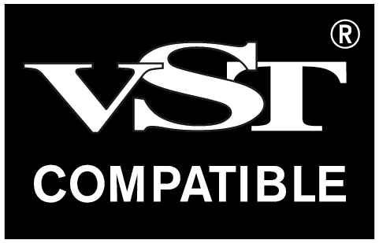

# flutter_vst3 Toolkit

**Build professional VST® 3 plugins and hosts with Flutter UI and pure Dart audio processing.**



*VST® is a trademark of Steinberg Media Technologies GmbH, registered in Europe and other countries.*

This toolkit enables developers to create professional VST® 3 audio plugins with modern Flutter UIs while leveraging the power of pure Dart for real-time audio processing. Zero C++ knowledge required.

## Architecture Overview

### VST® 3 Plugin Architecture with Native Dart Executable

The toolkit compiles Dart code to **native machine code executables** that communicate with the VST® 3 wrapper via IPC (Inter-Process Communication). This provides true native performance without requiring the Dart runtime in the DAW.

```mermaid
graph TB
    subgraph "DAW Integration"
        DAW1[Ableton Live]
        DAW2[FL Studio]
        DAW3[Reaper]
        DAW4[Other VST® 3 Hosts]
    end
    
    subgraph "flutter_vst3 Toolkit"
        subgraph "VST Creation"
            FR[flutter_reverb<br/>Flutter VST® Plugin]
            ECHO[echo<br/>Flutter VST® Plugin]
            FVST[flutter_vst3<br/>VST® Building Framework]
        end
        
        subgraph "VST Hosting"
            DVH[dart_vst_host<br/>Load & Control VSTs]
            DVG[dart_vst_graph<br/>Audio Routing & Mixing]
        end
        
        subgraph "Native Bridge"
            NL[C++ VST® 3 Implementation<br/>Built via CMake]
            PL[VST® 3 Plugin Wrapper<br/>+ IPC to Dart Executable]
        end
    end
    
    subgraph "External VSTs"
        VST1[TAL Reverb]
        VST2[Other VST® 3 Plugins]
    end
    
    %% VST Creation Flow
    FR --> FVST
    ECHO --> FVST
    FVST --> PL
    PL --> NL
    
    %% VST Hosting Flow  
    VST1 --> DVH
    VST2 --> DVH
    DVH --> DVG
    DVG --> NL
    
    
    %% DAW Integration
    NL --> DAW1
    NL --> DAW2
    NL --> DAW3
    NL --> DAW4
    
    style FR fill:#e1f5fe
    style ECHO fill:#e1f5fe
    style FVST fill:#e1f5fe
    style DVH fill:#fff3e0
    style DVG fill:#fff3e0
    style NL fill:#f3e5f5
    style PL fill:#f3e5f5
```



### Native Executable Implementation

```mermaid
sequenceDiagram
    participant DAW
    participant VST3[VST® 3 Plugin (C++)]
    participant IPC[Binary IPC Protocol]
    participant DART[Dart Native Executable]
    participant UI[Flutter UI Window]
    
    Note over VST3,UI: Plugin Initialization
    VST3->>DART: Spawn dart_processor executable
    DART->>VST3: ACK ready
    VST3->>UI: Create Flutter window
    UI->>DART: Connect parameter binding
    
    Note over DAW,UI: Audio Processing
    DAW->>VST3: Process audio buffer
    VST3->>IPC: Send binary audio data
    IPC->>DART: Deserialize & process
    DART->>IPC: Return processed audio
    IPC->>VST3: Binary response
    VST3->>DAW: Return processed buffer
    
    Note over DAW,UI: Parameter Changes (3-way binding)
    DAW->>VST3: Set parameter
    VST3->>DART: Send parameter update
    DART->>UI: Notify UI of change
    UI->>UI: Update knobs/sliders
```



## Package Overview

### 🎛️ VST® 3 Plugin Creation

**Primary Purpose: Build VST® 3 plugins with Flutter UIs that compile to .vst3 bundles**

- **`flutter_vst3`** - Complete framework that auto-generates all C++ VST® 3 boilerplate from Dart
- **`vsts/flutter_reverb`** - Example VST® 3 reverb plugin with Flutter UI  
- **`vsts/echo`** - Example VST® 3 echo/delay plugin with Flutter UI
- **Native Executable Compilation** - Dart compiles to native machine code (no runtime required)

### 🎧 VST® Hosting Packages  

**Primary Purpose: Load and control existing VST® 3 plugins from Dart applications**

- **`dart_vst_host`** - High-level API for loading and controlling VST® 3 plugins
- **`dart_vst_graph`** - Audio graph system for routing and mixing VST® plugins

### 🔧 Native Infrastructure

- **VST® 3 native components** - C++ implementation using Steinberg VST® 3 SDK (built via CMake)
- **Plugin wrappers** - VST® 3 plugin wrappers that host Dart audio processing

## Key Features

### Flutter UI + Dart Audio Processing
- ✅ **Beautiful Flutter UIs** - Modern, reactive plugin interfaces
- ✅ **Pure Dart DSP** - Write audio algorithms in familiar Dart syntax
- ✅ **Hot Reload** - Instant UI updates during development
- ✅ **3-Way Parameter Binding** - DAW ↔ Flutter UI ↔ C++ parameters stay in sync
- ✅ **Zero C++ Required** - Framework auto-generates all VST® 3 boilerplate

### Native Performance
- ✅ **Native Machine Code** - Dart compiles to native executables
- ✅ **No Runtime Overhead** - No Dart VM or JIT in production
- ✅ **Process Isolation** - Plugin crashes won't affect DAW
- ✅ **Small Binary Size** - Minimal footprint in DAW

### Cross-Platform Support
- ✅ **macOS** - Universal binaries (Intel + Apple Silicon)
- ✅ **Windows** - Native Windows VST® 3 support
- ✅ **Linux** - Full Linux VST® 3 support

## Quick Start

### Prerequisites

```bash
# Download Steinberg VST® 3 SDK
./setup.sh  # Automatically downloads SDK and builds native libraries

# Or manually set VST3_SDK_DIR
export VST3_SDK_DIR=/path/to/vst3sdk
```

### Building Your First VST® Plugin

1. **Build the example plugins:**
```bash
# Build Flutter Reverb VST® 3 (default)
make

# Build specific plugins:
make reverb-vst       # Build flutter_reverb.vst3
make echo-vst         # Build echo.vst3

# Install to system VST folder
make install
```

2. **Test in your DAW:**
- macOS: `~/Library/Audio/Plug-Ins/VST3/`
- Windows: `C:\Program Files\Common Files\VST3\`
- Linux: `~/.vst3/`

### Creating Your Own VST® Plugin

1. **Define parameters with Flutter UI bindings:**
```dart
// lib/src/my_parameters.dart
class MyParameters {
  /// Controls the output volume (0% = silence, 100% = full volume)
  double gain = 0.5;
  
  /// Adds warmth to the signal (0% = clean, 100% = saturated)
  double warmth = 0.0;
}
```

2. **Implement your audio processor:**
```dart
// lib/src/my_processor.dart
class MyProcessor {
  void processStereo(List<double> inputL, List<double> inputR,
                    List<double> outputL, List<double> outputR,
                    MyParameters params) {
    for (int i = 0; i < inputL.length; i++) {
      outputL[i] = inputL[i] * params.gain;
      outputR[i] = inputR[i] * params.gain;
    }
  }
}
```

3. **Create Flutter UI with parameter binding:**
```dart
// lib/my_ui_main.dart
import 'package:flutter/material.dart';
import 'package:flutter_vst3/flutter_vst3.dart';

void main() {
  runApp(MyPluginUI());
}

class MyPluginUI extends StatefulWidget {
  @override
  _MyPluginUIState createState() => _MyPluginUIState();
}

class _MyPluginUIState extends State<MyPluginUI> {
  final parameters = MyParameters();
  
  @override
  void initState() {
    super.initState();
    // Register for DAW parameter changes
    VST3Bridge.registerParameterChangeCallback(_onParameterChanged);
  }
  
  void _onParameterChanged(int paramId, double value) {
    setState(() {
      parameters.setParameter(paramId, value);
    });
  }
  
  void _updateParameter(int paramId, double value) {
    setState(() {
      parameters.setParameter(paramId, value);
    });
    // Send to VST host/DAW
    VST3Bridge.sendParameterToHost(paramId, value);
  }
  
  @override
  Widget build(BuildContext context) {
    return MaterialApp(
      home: Scaffold(
        body: Column(
          children: [
            Text('My VST Plugin'),
            Slider(
              value: parameters.gain,
              onChanged: (v) => _updateParameter(0, v),
            ),
          ],
        ),
      ),
    );
  }
}
```

4. **CMake automatically generates everything else!**

### Building a VST® Host Application

```dart
import 'package:dart_vst_host/dart_vst_host.dart';
import 'package:dart_vst_graph/dart_vst_graph.dart';

void main() async {
  // Initialize host
  final host = VstHost();
  await host.initialize();
  
  // Load VST plugin (including Flutter-based VSTs!)
  final plugin = await host.loadPlugin('flutter_reverb.vst3');
  
  // Create audio graph
  final graph = VstGraph();
  final pluginNode = graph.addVstNode(plugin);
  final mixerNode = graph.addMixerNode();
  
  // Connect nodes
  graph.connect(pluginNode.output, mixerNode.input1);
  
  // Start processing
  await graph.start();
}
```

## Project Structure

```
flutter_vst3_toolkit/
├── flutter_vst3/           # Framework for building VST® 3 plugins with Flutter
│   ├── lib/
│   │   ├── flutter_vst3.dart
│   │   └── src/
│   │       ├── flutter_vst3_bridge.dart    # DAW ↔ Flutter binding
│   │       ├── flutter_vst3_callbacks.dart # FFI callbacks
│   │       └── flutter_vst3_parameters.dart # Parameter management
│   ├── native/             # C++ templates and CMake helpers
│   └── scripts/            # Plugin generation scripts
├── vsts/
│   ├── flutter_reverb/     # Example reverb with Flutter UI
│   └── echo/              # Example echo with Flutter UI
├── dart_vst_host/         # VST® 3 hosting API for Dart
├── dart_vst_graph/        # Audio graph system
├── vst3sdk/               # Steinberg VST® 3 SDK
└── Makefile              # Build automation
```

## Development Workflow

### VST® Plugin Development
1. Design UI in Flutter with hot reload
2. Implement audio processing in pure Dart
3. Test with `flutter run`
4. Build VST® 3: `make echo-vst`
5. Load in DAW and test

### Parameter Binding System
The framework provides automatic 3-way parameter binding:
- **DAW → Flutter UI**: Parameter changes in DAW update Flutter UI
- **Flutter UI → DAW**: UI interactions update DAW parameters
- **Flutter UI → Processor**: UI changes update audio processing

## Examples in Production

### Flutter Reverb Plugin
- Full reverb algorithm in pure Dart
- Real-time parameter updates
- Ships as standard .vst3 bundle

### Echo Plugin
- Delay/echo effect with feedback
- Bypass control
- Parameter automation support

## Testing

```bash
# Run all tests
make test

# Test individual packages
cd flutter_vst3 && dart test
cd vsts/echo && dart test
cd dart_vst_host && dart test
cd dart_vst_graph && dart test

# Interactive testing with example plugins
cd vsts/flutter_reverb && flutter run
```

## Contributing

This toolkit is designed for professional audio development. Contributions should maintain:

- **No duplication**: Use existing components
- **No placeholders**: Implementation must be complete  
- **Pure FP style**: Immutable data, pure functions
- **Flutter-first**: Leverage Flutter's UI capabilities
- **Clear documentation**: All public APIs documented

## Legal Notice

This project is not affiliated with, endorsed by, or sponsored by Steinberg Media Technologies GmbH.
VST® is a trademark of Steinberg Media Technologies GmbH, registered in Europe and other countries.

The flutter_vst3 Toolkit interfaces with the Steinberg VST® 3 SDK under the terms of the VST® 3 SDK License Agreement.
Users must comply with the Steinberg VST® 3 SDK License Agreement when distributing VST® 3 plugins.

For more information about VST® 3 licensing:
https://steinbergmedia.github.io/vst3_dev_portal/pages/VST+3+Licensing/Index.html

## License

See LICENSE file. Commercial use requires compliance with Steinberg VST® 3 licensing terms.

---

**Ready to build the next generation of audio plugins with Flutter and Dart? Start with the examples and unleash your creativity!**